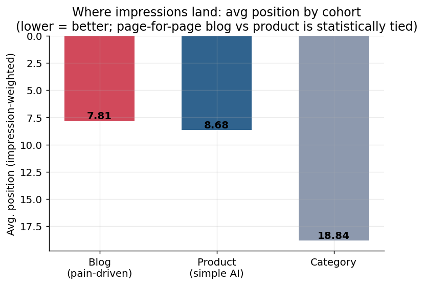
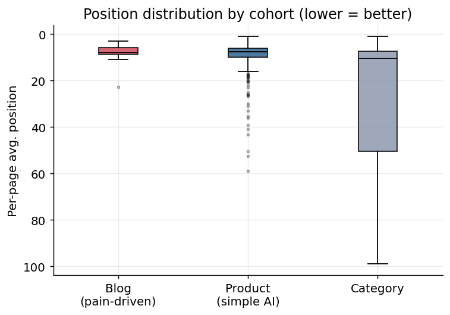
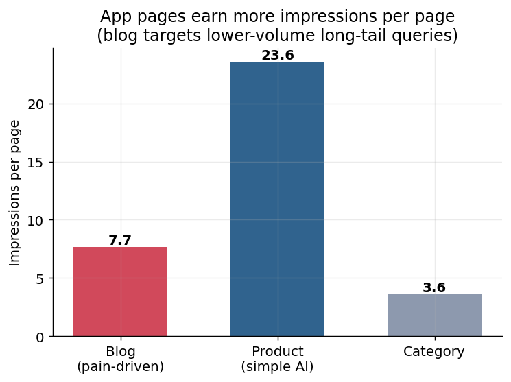
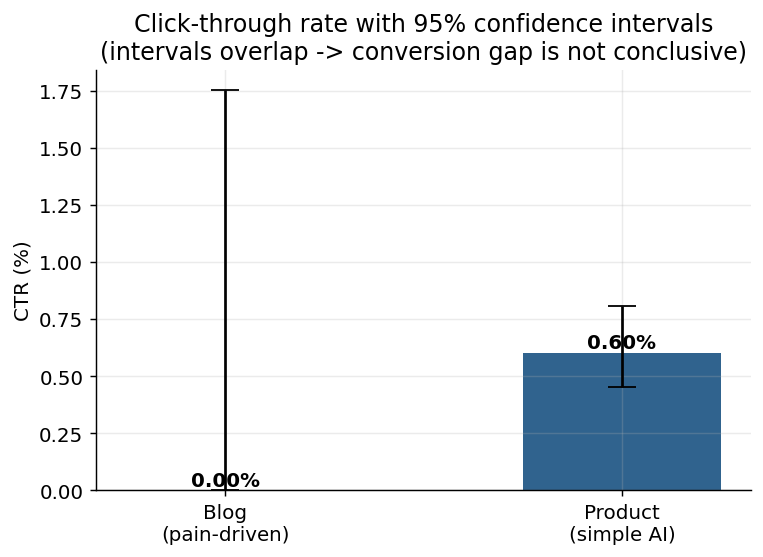
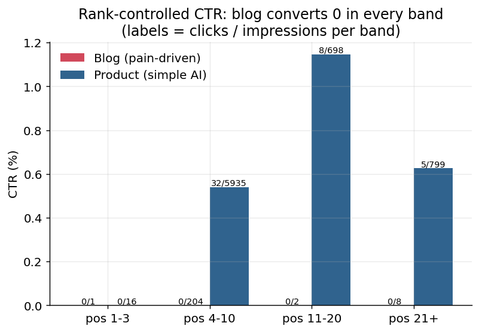
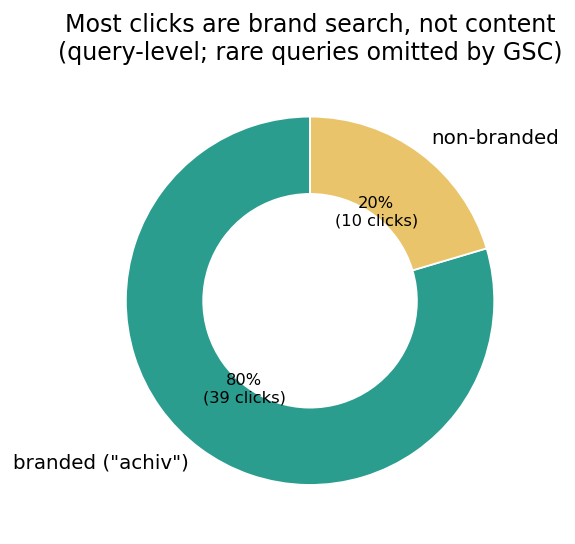
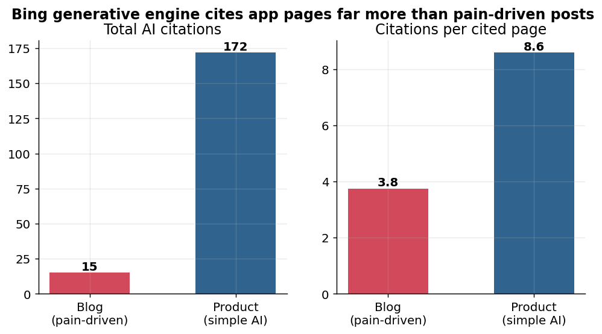

# Experiment 1 — Does pain-driven content rank and convert better than simple AI content?

*A search-performance comparison of two AI-generated content types on [achiv.com](https://achiv.com), using a Google Search Console export for 1 Apr – 1 Jun 2026.*

---

## Abstract

`achiv.com` publishes two kinds of AI-generated pages: **app-directory pages**
(AI-written descriptions, reviews, taglines) and **blog posts** whose topics are
mined from aggregated Reddit pain points and objections ("pain-driven" content).
The hypothesis under test: *pain-driven blog content ranks and performs better in
organic search than ordinary AI app pages.*

Over a two-month window in which both content types were already indexed, the
hypothesis is **not supported in its strong form**. Page-for-page, pain-driven
articles rank **no better than** app pages (Mann–Whitney U, *p* = 0.19), earn
**~3× fewer impressions per page** (7.7 vs 23.6), and produced **zero clicks**
across 28 articles and 215 impressions. The one point in the strategy's favour:
blog articles rank **more consistently** on page 1 (89% in the top 10, with no
poor-ranking tail), so the *visibility* is there — the *click* is not. The
loudest signal in the data is orthogonal to the hypothesis: **80% of all clicks
come from the brand query "achiv."** A second, independent lens — **Bing's
generative-engine citations** — points the same way: app pages were cited
**172** times vs the blog's **15**. The practical lesson aligns with this
repository's thesis — ranking and citations (classic *or* AI) do **not**
automatically convert to clicks.

> **Verdict:** ❌ Strong hypothesis busted · ⚠️ Conversion gap real but not
> statistically conclusive (blog click sample is too small) · 💡 The real lever
> is intent-to-click, not ranking.

---

## 1. Hypothesis

> Blog posts written around real, aggregated user pain points will rank higher
> and drive more engagement than AI-generated app-directory pages that merely
> describe a product.

We decompose "perform better" into three measurable questions:

1. **Ranking** — do pain-driven pages achieve better positions?
2. **Visibility** — do they earn more impressions (citations) per page?
3. **Conversion** — do they convert impressions into clicks at a higher rate?

## 2. Data & provenance

| Field | Value |
|---|---|
| Source | Google Search Console → Performance → Export |
| Property | `achiv.com` |
| Search type | Web |
| Window | **1 Apr 2026 – 1 Jun 2026** (2 months) |
| Dimensions used | `Pages.csv`, `Queries.csv` (raw export under [`gsc/`](gsc/)) |
| GEO supplement | **Bing AI Page Stats** export — citations per page in Bing's generative answers ([`bing_ai/`](bing_ai/), pulled 12 Jun 2026) |

The window deliberately starts **after** the first wave of blog posts was
indexed, so neither cohort is measured during its initial ramp-up. Both content
types are AI-generated; the **only** intended difference is *how the topic was
chosen* — product description vs. mined Reddit pain point.

**Known limitations of the data** (see §6 for how they bound the conclusions):

- GSC `Pages.csv` is **aggregate-only** — no per-page daily series and **no
  page × query join**, so branded clicks cannot be subtracted from a specific page.
- GSC **anonymises rare queries**: `Queries.csv` accounts for only 49 of the 95
  page-level clicks, so the branded split is directional, not exact.
- Position is an **average rank across all of a page's queries**, not a single
  ranking.

## 3. Method

### 3.1 Cohorts

Pages are classified by URL ([`scripts/config.py`](scripts/config.py) →
`classify_url`):

| Cohort | URL pattern | Role | Pages |
|---|---|---|---:|
| **Blog (pain-driven)** | `/blog/<uuid>-slug/` | treatment | 28 |
| **Product (simple AI)** | `/product/<slug>/` (canonical) | baseline | 316 |
| Category (context) | `/category/...` | context | 114 |
| Product subpages (context) | `/product/<slug>/.../` (e.g. `/feedback/`) | context | 129 |
| Other (home/nav) | `/`, `/about`, `/blog/` index | context | 12 |

Two deliberate exclusions keep the comparison clean:

- The bare **`/blog/` index** is navigation, not an article — and it is the only
  blog URL with a click, so leaving it in would manufacture a false positive.
- **`/product/.../feedback/` subpages** are secondary; comparing one blog article
  to one canonical app page keeps the unit of analysis consistent.

### 3.2 Controls

1. **Branded exclusion.** Quantify how many clicks come from the navigational
   query "achiv" so content performance is not credited for brand search.
2. **Rank control.** Compare CTR *within* position bands (1–3, 4–10, 11–20, 21+),
   so "blog converts less" cannot be dismissed as merely "blog sits where CTR is
   naturally low."
3. **Statistical honesty.** Per-page positions compared with the non-parametric
   **Mann–Whitney U** test; CTRs reported with **95% Wilson confidence
   intervals** (robust at zero clicks). All raw figures are written to
   [`outputs/`](outputs/).

Reproduce everything with:

```bash
python3 -m pip install -r ../requirements.txt
python3 scripts/main.py        # reads gsc/, writes outputs/
```

## 4. Results

### 4.1 Ranking — a statistical tie, but blog is more consistent





| Metric | Blog (pain-driven) | Product (simple AI) |
|---|---:|---:|
| Median position | 7.90 | **7.75** |
| Mean position | **7.90** | 9.69 |
| Impression-weighted position | **7.81** | 8.68 |
| Share in top 10 | **89.3%** | 74.7% |
| Share in top 3 | **3.6%** | 1.9% |

The cohorts are **statistically indistinguishable** on per-page rank
(Mann–Whitney U = 3983, *p* = 0.19; a random blog page outranks a random product
page just 45% of the time). Product is a hair better at the **median**, but its
distribution has a long tail of poorly-ranking pages (down to position 59) that
drags its *mean* and *weighted* position down. Blog, by contrast, is **tight and
consistently on page 1** — no page ranks worse than ~23. So pain-driven content
does not *rank higher*, but it does rank **more reliably**.

### 4.2 Visibility — app pages earn far more impressions per page



App pages collect **23.6 impressions/page** vs the blog's **7.7** — roughly 3×.
This is by design: pain-point articles target **low-volume, long-tail
informational queries**, whereas app pages capture app-name and category demand.
More reliable ranking (§4.1) does not compensate for a smaller addressable
search volume.

### 4.3 Conversion — blog produced zero clicks; the gap is real but not conclusive





| | Blog (pain-driven) | Product (simple AI) |
|---|---:|---:|
| Clicks | **0** | 45 |
| Impressions | 215 | 7,448 |
| CTR | 0.00% | 0.60% |
| CTR 95% CI (Wilson) | **0 – 1.76%** | 0.45 – 0.81% |

Across 28 articles and 215 impressions, pain-driven content earned **zero
clicks**. But the click sample is tiny: the Wilson interval for blog CTR
(0–1.76%) **overlaps** product's (0.45–0.81%), so we **cannot** declare a
statistically significant conversion gap. The **rank-controlled** view is more
telling: in the position 4–10 band — where 204 of blog's 215 impressions sit —
product converts at **0.54% (32/5,935)** while blog sits at **0% (0/204)**. At
that rate blog would *expect* ~1 click; getting 0 is suggestive of a real gap
but still within sampling noise.

### 4.4 The dominant signal — most clicks are brand search



Of the clicks GSC attributes to a query, **80% come from the single branded term
"achiv"** (39 of 49). Non-branded content — *both* cohorts combined — drew only
**10 clicks across 223 distinct queries**. Whatever either content strategy is
doing, almost none of the site's measured conversion is content-driven discovery;
it is people typing the brand name.

### 4.5 GEO lens — AI-answer citations tell the same story



A separate signal — how often each page is cited inside **Bing's generative
answers** — provides an independent check on which content AI engines actually
surface. *(This is a Bing GEO metric and is deliberately not merged with the
Google clicks above; the two come from different engines.)*

| | Blog (pain-driven) | Product (simple AI) |
|---|---:|---:|
| Total AI citations | 15 | **172** |
| Pages cited | 4 | 20 |
| Citations per cited page | 3.8 | **8.6** |
| Citation coverage (cited / cohort pages) | **14% (4/28)** | 6% (20/316) |

App pages dominate AI citations **11-to-1** in absolute terms and are cited
**2.3×** more intensely per page. The single nuance in the blog's favour: a
*larger share* of pain-driven articles earned at least one AI citation (14% vs
6%), hinting that pain-point framing is slightly more "quotable." But the volume
is overwhelmingly with app pages — pain-driven content is **not** winning the GEO
race either, and (cf. §4.3) even the citations it does earn produced no clicks.

## 5. Discussion

The strong hypothesis — *pain-driven content ranks and performs better* — is
**not supported** by this window:

- It does **not rank better** (statistical tie).
- It earns **fewer impressions per page** (long-tail by design).
- It has converted **0 clicks** so far (though not significantly below product's
  near-floor rate).
- It is **cited far less by AI engines** (15 vs 172 Bing citations), so it is not
  winning on the GEO frontier either.

Yet the data is not a clean indictment of the strategy either, and the nuance is
where the value is:

1. **The raw material for clicks exists.** Pain-driven articles rank *reliably*
   on page 1 (89% top-10, zero long tail). They are *seen*. The failure is the
   last step — turning an impression into a click.
2. **The bottleneck is intent-to-click, not ranking.** 80% of real clicks are
   brand search; non-branded informational content (of either kind) barely
   converts. Ranking and citations are necessary but nowhere near sufficient.

This is exactly the question this repository exists to answer: **"What do I need
to do so that citations convert, instead of merely existing?"** Experiment 1
shows that *getting cited / ranking is the easy part* — pain-driven topics even
do it more consistently — but neither AI content type closes the gap to a click.
The next experiments should attack the click itself: title/snippet match to the
searcher's intent, SERP presentation, and whether pain-point *framing in the
title* (not just the topic) moves CTR.

## 6. Limitations

- **Small treatment sample.** 28 articles, 215 impressions, 0 clicks → wide
  confidence intervals; the conversion gap is suggestive, not proven.
- **No page × query join.** Branded clicks can't be removed from individual
  product pages, so product CTR may be modestly inflated by semi-navigational
  app-name queries.
- **Query anonymisation.** ~46 of 95 clicks have no visible query; the 80/20
  branded split is directional.
- **Recency & demand asymmetry.** Even post-indexing, blog topics are inherently
  lower-volume long-tail; an impressions-per-page comparison partly reflects
  query demand, not content quality.
- **Cross-platform GEO signal.** AI-citation counts are from **Bing**, while
  clicks/impressions are from **Google** — they corroborate each other but cannot
  be combined into one citation→click funnel. The Bing export also lists only
  pages with ≥1 citation, so cohort coverage rates use GSC page counts as the
  denominator.
- **Single site, single window.** No seasonality control; results describe
  `achiv.com` over two months, not content strategy in general.

## 7. Reproduction

```bash
# from the repository root
python3 -m pip install -r requirements.txt
python3 1_pain_driven_content_comparison/scripts/main.py
```

Outputs are written deterministically to [`outputs/`](outputs/):

| File | Contents |
|---|---|
| `summary_metrics.csv` | per-cohort volume, rate, ranking metrics + Wilson CIs |
| `position_distribution.csv` | position quantiles per cohort |
| `ctr_by_position_band.csv` | rank-controlled CTR table |
| `branded_vs_nonbranded.csv` | branded vs non-branded query split |
| `ai_citations_by_cohort.csv` | Bing AI-citation totals per cohort |
| `statistical_tests.csv` | Mann–Whitney U result |
| `1`…`7_*.png` | the seven figures above |

Scripts: [`scripts/config.py`](scripts/config.py) (paths, cohort rules, stats
helpers) · [`scripts/analyze.py`](scripts/analyze.py) (metrics + tests) ·
[`scripts/charts.py`](scripts/charts.py) (figures) ·
[`scripts/main.py`](scripts/main.py) (entrypoint).
